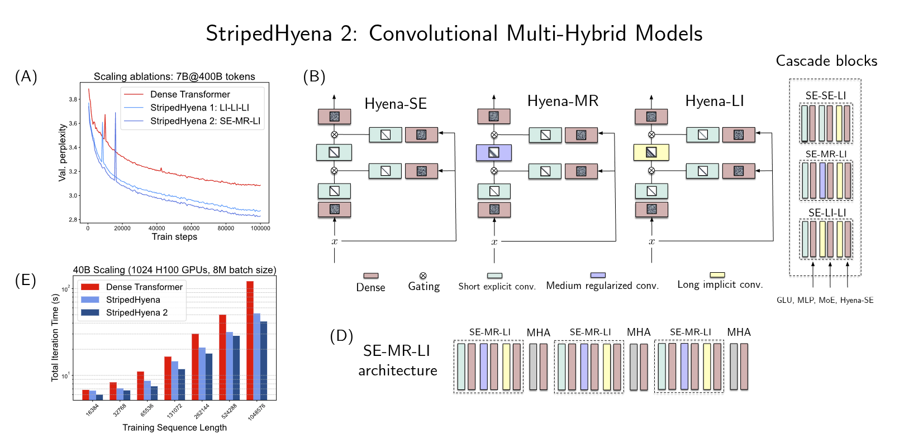

<div align="center">
    <h1>Savanna</h1>
</div>

Pretraining infrastructure for research and application of [convolutional multi-hybrid models](paper.pdf) (StripedHyena 2).


## What is Savanna?

Savanna is an open-source pretraining framework for alternative architectures. It is built on top of components from other open-source projects, including:
* [DeepSpeed](https://github.com/microsoft/DeepSpeed): ZeRO sharding
* [GPT-NeoX](https://github.com/EleutherAI/gpt-neox): general repository structure, configuration
* [TransformerEngine](https://github.com/NVIDIA/TransformerEngine): FP8 support

It extends these projects with additional features, including:
* Multi-hybrid model support (StripedHyena, StripedHyena 2)
* byte-level tokenization and training
* tuner for distributed hyperparameters
* a2a and p2p context parallelism
* various optimization for graceful scaling on thousand-GPU clusters

A variety of models have been trained and finetuned on Savanna, including:
* [StripedHyena 7B](https://github.com/togethercomputer/stripedhyena/stargazers): 256 GPUs
* [Evo 1 7B](https://github.com/evo-design/evo): 256 GPUs
* [Evo 2 7B](https://github.com/ArcInstitute/evo2): 256 GPUs, over 2T tokens
* [Evo 2 40B](https://github.com/ArcInstitute/evo2): 2048 GPUs, over 9T tokens, 1M context

Savanna is a framework developed and maintained by a small team (< 5 people), tailored to the specific needs of the projects above. With careful tuning of the distributed training strategy and architecture, it achieves high MFU on H100s at the thousand-GPU scale. **It is not a production-ready framework, expect rough edges if you don't know what you're doing.** It can serve as a good starting point for research on large-scale training of multi-hybrids. We recommend digging around the training configs for the models above: all the details are there.

For inference using multi-hybrids, check out the [vortex](https://github.com/Zymrael/vortex) project.

<div align="center">

</div>


## Install 

`make setup-env` will install the necessary dependencies and detect if you have an active (non-base) python environment. 

If TransformerEngine wheel installation fails on your cluster, check the [official docs](https://docs.nvidia.com/deeplearning/transformer-engine/user-guide/index.html) for more details (tip: when using conda, you can get most missing headers easily with `conda install -c conda-forge cudatoolkit` and `conda install -c conda-forge cudnn`. Make sure to add the right header paths to `CPATH`).

## Quick Start 

After tokenization of a dataset split (or splits), launch with:

```bash
python launch.py train.py -d configs data/<config>.yml model/<model>.yml
```

## How do Convolutional Multi-Hybrid Architectures Work?

Multi-hybrid models combine many different classes of operators such as convolutions to balance quality and efficiency at short and long context, compared to previous generation striped hybrids. *Convolutional* multi-hybrids combine multiple input-dependent convolutional operators: Hyena-SE, Hyena-MR, Hyena-LI. These use the standard Hyena structure with different parametrizations for the convolutions. 

Multi-hybrid architectures excel at modeling byte or character-tokenized data, such as DNA sequences.

#### Parametrizations

`explicit_single_decay`: (for Hyena-MR) Explicit parametrization of filter coefficients in time domain, followed by exponential decay.

`implicit_freeform`: (for Hyena-LI) Free-form parametrization of the filters via a shallow network with sine activations, followed by exponential decays of different rates.


`implicit_modal`: (for Hyena-LI) Real modal diagonal parametrization (poles and residues), uses a mSISO (multi-input single-output) structure

`explicit`: (for Hyena-SE). Not supported via config. Automatically selected with operator type `hyena_se`.


#### Kernels and Context Parallelism

`gcg_two_pass`: Chunked direct convolutions via two-pass GEMMs. Best used with finite impulse response convolution (windowed) parametrization (e.g., Hyena-SE, Hyena-MR).

`hyena_mlp`: custom kernel for short Hyena replacements to MLPs.

`savanna/model/operators/hyena/distributed_a2a.py`: context parallel algorithms for Hyena-LI.

`savanna/model/operators/hyena/p2p_cp_conv.py`: context parallel algorithm for short explicit convolutions (Hyena-SE, or input featurizer convolutions).


## E2E Testing

### Regression Testing
When submitting PRs, please make sure to run the regression test SLURM job `./run_regression_test.sh`

The script runs two pre-defined model configs, a single-gpu and 4-gpu model parallel config.  The script automatically allocates the necessary resources via SLURM.
- Usage:
  - Run the script from within the savanna root directory. 
  - Alternatively, provide the required paths to the data and model configs.
  - See `./run_regression_test.sh --help` to see full list of commandline options (config paths, checkpoint, log directories, etc.)
- Please run with the default number of iterations (2000) if making model architecture or parallelism changes.  
- For minor infrastructure changes, ok to run -- to completion -- with a smaller number of iterations
  - E.g. `./run_regression_test.sh --train-iters-1 100 --train-iters-2 100`

### Code Style

Install `ruff`, an all-in-one code linting and formatting tool. Then run:
```
make check
```
This will call ruff to check all files in `savanna` and enumerate formatting / linting fixes without actually making any code changes.

Run:
```
make style
```
to then fix these changes.  Not all changes will be fixable, some will need be manually fixed.


## Contributors

Savanna is developed by Michael Poli ([Zymrael](https://github.com/Zymrael)), Eric Nguyen ([exnx](https://github.com/exnx)), Jerome Ku ([jeromeku](https://github.com/jeromeku)), Brian Hie ([brianhie](https://github.com/brianhie)), with contributions from Garyk Brixi ([garykbrixi](https://github.com/garykbrixi)), David W. Romero ([dwromero](https://github.com/dwromero)), Dave Burke ([daveyburke](https://github.com/daveyburke)), Brandon Yang ([bclyang](https://github.com/bclyang)), Armin W. Thomas ([athms](https://github.com/athms)), Ali Taghibakhshi ([JRD971000](https://github.com/JRD971000)), Greg Brockman ([gdb](https://github.com/gdb)).

## Cite

If you find this project useful, consider citing the following [references](CITE.md).
